Très bien ! Passons maintenant à l'**étape 4 : Diagrammes de Séquence**. Cette étape consiste à illustrer les interactions entre les différents composants du système pour les cas d'utilisation clés. Nous allons créer des diagrammes de séquence pour les principales fonctionnalités de votre site e-commerce.

---

### **Étape 4 : Diagrammes de Séquence**

#### **4.1 Objectif des Diagrammes de Séquence**
Les diagrammes de séquence montrent comment les composants interagissent entre eux pour réaliser une fonctionnalité spécifique. Ils sont utiles pour :
- Clarifier les flux de données.
- Identifier les points d'intégration entre les composants.
- Faciliter la communication entre les membres de l'équipe.

---

#### **4.2 Outils pour Créer des Diagrammes de Séquence**
Voici quelques outils que vous pouvez utiliser :
- **Lucidchart** : Très intuitif et collaboratif.
- **Draw.io** : Gratuit et facile à utiliser.
- **PlantUML** : Pour ceux qui préfèrent un outil basé sur du texte.

---

#### **4.3 Cas d'Utilisation Clés**
Nous allons créer des diagrammes de séquence pour les fonctionnalités suivantes :

1. **Ajouter un produit au panier.**
2. **Passer une commande.**
3. **Gérer les produits (pour l'administrateur).**

---

##### **4.3.1 Ajouter un Produit au Panier**
Voici un diagramme de séquence simplifié pour cette fonctionnalité :

```
Utilisateur -> Front-end : Clique sur "Ajouter au panier"
Front-end -> Back-end : Envoie une requête POST /cart/add
Back-end -> Base de Données : Vérifie la disponibilité du produit
Base de Données -> Back-end : Renvoie les informations du produit
Back-end -> Base de Données : Met à jour le panier de l'utilisateur
Base de Données -> Back-end : Confirme la mise à jour
Back-end -> Front-end : Renvoie une confirmation
Front-end -> Utilisateur : Affiche un message de succès
```

---

##### **4.3.2 Passer une Commande**
Voici un diagramme de séquence simplifié pour cette fonctionnalité :

```
Utilisateur -> Front-end : Clique sur "Passer la commande"
Front-end -> Back-end : Envoie une requête POST /checkout
Back-end -> Base de Données : Vérifie le stock des produits
Base de Données -> Back-end : Renvoie les informations de stock
Back-end -> Stripe : Envoie les détails de paiement
Stripe -> Back-end : Confirme le paiement
Back-end -> Base de Données : Crée une nouvelle commande
Base de Données -> Back-end : Renvoie la confirmation
Back-end -> Front-end : Renvoie la confirmation de commande
Front-end -> Utilisateur : Affiche la confirmation
```

---

##### **4.3.3 Gérer les Produits (Administrateur)**
Voici un diagramme de séquence simplifié pour cette fonctionnalité :

```
Administrateur -> Front-end : Clique sur "Ajouter un produit"
Front-end -> Back-end : Envoie une requête POST /products/add
Back-end -> Base de Données : Ajoute le nouveau produit
Base de Données -> Back-end : Confirme l'ajout
Back-end -> Front-end : Renvoie une confirmation
Front-end -> Administrateur : Affiche un message de succès
```

---

#### **4.4 Exemple de Diagramme de Séquence (Texte)**
Voici un exemple de diagramme de séquence en texte (format PlantUML) pour l'ajout d'un produit au panier :

```plantuml
@startuml
actor Utilisateur
participant "Front-end" as FE
participant "Back-end" as BE
participant "Base de Données" as BD

Utilisateur -> FE : Clique sur "Ajouter au panier"
FE -> BE : POST /cart/add
BE -> BD : Vérifie la disponibilité du produit
BD --> BE : Renvoie les informations du produit
BE -> BD : Met à jour le panier de l'utilisateur
BD --> BE : Confirme la mise à jour
BE --> FE : Renvoie une confirmation
FE --> Utilisateur : Affiche un message de succès
@enduml
```



---

### **Livrable pour l'Étape 4**
À la fin de cette étape, vous devriez avoir :
1. **Des diagrammes de séquence** pour les cas d'utilisation clés.
2. **Une explication détaillée** des interactions entre les composants.

---

### **Prochaines Étapes**
Une fois cette étape terminée, nous passerons à l'**étape 5 : Documentation des API**. Si vous avez des questions ou des ajustements à apporter, n'hésitez pas à me le dire ! 😊